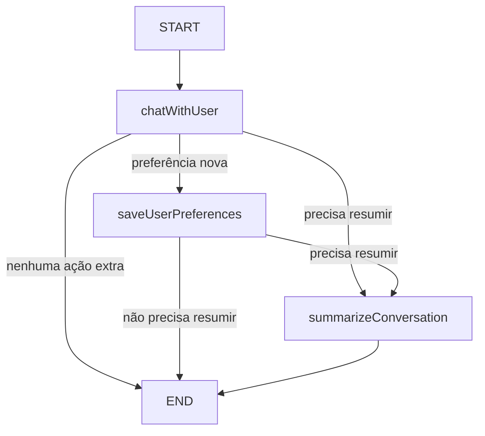

# poc_java_ia_recomendadormusical

POC didática de um **recomendador musical com memória**, migrada do projeto JavaScript/TypeScript do Módulo 04 para **Java 21 + Spring Boot**.

O objetivo principal não é criar um “Spotify completo”. O objetivo é entender, de forma simples, como uma aplicação com IA pode:

1. conversar com um usuário;
2. recomendar músicas;
3. perceber preferências explicitamente informadas pelo usuário;
4. guardar essas preferências;
5. lembrar do usuário em uma conversa futura;
6. manter o histórico recente da conversa;
7. resumir o histórico quando ele começa a ficar grande.

> Este README foi escrito pensando em quem já conhece programação Java, mas ainda está começando em Inteligência Artificial.

---

## 1. O problema que estamos resolvendo

Imagine uma API sem memória:

```text
Usuário: Eu gosto de rock e minha banda favorita é Queen.
IA: Legal! Aqui estão algumas recomendações.

[nova conversa]

Usuário: Me recomende alguma coisa baseada no meu gosto.
IA: Qual é o seu gosto musical?
```

A segunda conversa perdeu tudo o que já tinha sido dito.

Neste projeto queremos um comportamento diferente:

```text
Usuário: Eu gosto de rock e minha banda favorita é Queen.
        ↓
A aplicação identifica essas preferências.
        ↓
Guarda a memória de longo prazo no SQLite.
        ↓
Uma nova conversa começa em outra thread.
        ↓
A aplicação carrega as preferências do mesmo usuário.
        ↓
A IA consegue usar esse contexto para responder melhor.
```

Esse é um dos conceitos centrais apresentados nas transcrições do Módulo 04.

---

## 2. Tecnologias

| Tecnologia | Papel no projeto |
|---|---|
| Java 21 | linguagem principal |
| Spring Boot 3.5.16 | API REST e configuração da aplicação |
| LangChain4j 1.20.2 | integração Java com o modelo de linguagem através da API compatível com OpenAI |
| LangGraph4j 1.9.3 | implementação do fluxo em grafo, com nós, estado e arestas condicionais |
| OpenRouter | gateway para acessar modelos de IA |
| LangSmith | observabilidade/tracing da cadeia de execução |
| OpenTelemetry 1.65.0 | envia spans do Java ao LangSmith via OTLP |
| PostgreSQL | checkpoints do LangGraph4j: memória persistente da thread/conversa |
| SQLite | preferências e resumo de longo prazo do usuário |
| Docker Compose | inicialização local do PostgreSQL |
| JUnit 5 | testes |
| Postman | exemplos de chamadas à API |

### Por que Spring Boot 3.5.16?

O projeto é Java 21 e a versão 3.5.16 continua compatível com Java 21. Optei pela linha Spring Boot 3 para deixar o projeto próximo do ecossistema Spring que um desenvolvedor Java já conhece, sem introduzir uma migração adicional para Spring Boot 4 nesta POC.

### Por que LangChain4j e LangGraph4j?

O projeto JavaScript original usa **LangChain** e **LangGraph**. A regra da migração é preservar esses conceitos no Java.

- **LangChain4j** é usado para conversar com o LLM via OpenRouter.
- **LangGraph4j** é usado para montar o fluxo com nós e decisões condicionais.

Assim, não estamos substituindo o grafo por vários `if` espalhados por um service.

---

## 3. O que é um LLM?

LLM significa **Large Language Model**.

De forma simples, é o modelo que recebe texto e produz texto. Neste projeto ele tem duas responsabilidades principais:

1. conversar e recomendar músicas;
2. devolver informações estruturadas sobre preferências do usuário.

A nossa aplicação não “treina uma IA”. Ela chama um modelo já existente através do OpenRouter.

---

## 4. O que é OpenRouter?

O OpenRouter funciona como uma camada entre a nossa aplicação e diferentes provedores/modelos de IA.

O fluxo é:

```text
Spring Boot
   ↓
LangChain4j
   ↓
API compatível com OpenAI
   ↓
OpenRouter
   ↓
Modelo escolhido
```

O modelo é configurável por variável de ambiente:

```text
OPENROUTER_MODEL=arcee-ai/trinity-large-preview:free
```

Por fidelidade ao projeto das aulas, o padrão é `arcee-ai/trinity-large-preview:free`. O modelo continua configurável: se ele deixar de estar disponível, você pode trocar `OPENROUTER_MODEL` sem alterar o fluxo da aplicação.

Também preservamos a política de roteamento usada no exemplo original:

```text
OPENROUTER_PROVIDER_SORT_BY=throughput
OPENROUTER_PROVIDER_PARTITION=none
```

Isso pede ao OpenRouter que priorize endpoints com maior throughput e não faça a ordenação separadamente por modelo.

---

## 5. Por que pedir JSON para a IA?

Se perguntarmos apenas:

```text
Responda ao usuário.
```

teremos somente uma frase em texto.

Mas precisamos de duas coisas ao mesmo tempo:

1. a resposta que será mostrada ao usuário;
2. as preferências que precisam ser persistidas.

Por isso o prompt pede uma estrutura semelhante a:

```json
{
  "message": "Se você gosta de rock, experimente Everlong - Foo Fighters.",
  "preferences": {
    "name": "Vini",
    "age": null,
    "favoriteGenres": ["rock"],
    "favoriteBands": ["Queen"],
    "mood": null,
    "listeningContext": null,
    "additionalInfo": null
  },
  "shouldSavePreferences": true
}
```

O Java converte esse JSON para:

```java
StructuredMusicAssistantResponse
```

Isso é chamado de **saída estruturada**.

Além das instruções no prompt, a chamada Java usa `ResponseFormat` do LangChain4j com tipo `JSON`. Assim, a API recebe formalmente que esta requisição precisa de saída JSON, em vez de depender somente do texto do prompt. O parser Java continua validando a resposta antes de transformá-la em objetos do domínio. O modelo padrão foi mantido igual ao projeto original (`arcee-ai/trinity-large-preview:free`).

### Regra importante

Só guardamos algo como preferência quando o **usuário declarou isso explicitamente**.

Exemplo:

```text
IA: Eu recomendo Foo Fighters.
```

Isso **não significa** que Foo Fighters seja uma banda favorita do usuário.

---

## 6. Memória de curto prazo x memória de longo prazo

Esta distinção é a parte mais importante do projeto.

### 6.1 Memória da thread / curto prazo — PostgreSQL

Uma thread representa uma conversa específica.

Exemplo:

```text
threadId = conversa-123

Usuário: Gosto de rock.
IA: ...
Usuário: Agora quero algo mais calmo.
IA: ...
```

O estado dessa thread é persistido pelo **LangGraph4j `PostgresSaverV2`**.

Assim, mesmo se a aplicação Java reiniciar, o estado da thread pode continuar existindo no PostgreSQL.

### 6.2 Memória de longo prazo — SQLite

A memória de longo prazo pertence ao **usuário**, não à thread.

Exemplo:

```text
userId = vini

nome: Vini
gêneros favoritos: rock
bandas favoritas: Queen
contexto importante: gosta de música calma para estudar
```

Essas informações ficam no SQLite.

Portanto:

```text
Thread A ─┐
          ├── userId=vini ──> SQLite ──> preferências reutilizáveis
Thread B ─┘
```

Uma thread nova não herda todo o histórico da thread antiga, mas pode usar as preferências de longo prazo do mesmo usuário.

---

## 7. O que é LangChain4j neste projeto?

O LangChain4j não é o banco e não é o modelo de IA.

Ele é uma biblioteca Java que ajuda a integrar nossa aplicação com modelos de linguagem.

Neste projeto a classe principal é:

```text
OpenRouterMusicAssistantClient
```

Ela cria um `OpenAiChatModel`, aponta o `baseUrl` para o OpenRouter e envia:

```text
SystemMessage + UserMessage
```

para o modelo.

Depois recebe a resposta do modelo e transforma o JSON em um objeto Java.

---

## 8. O que é LangGraph4j neste projeto?

LangGraph4j organiza o processo como um **grafo de estados**.

Em vez de colocar tudo dentro de um único método enorme, temos passos específicos.



Essa estrutura corresponde ao fluxo do projeto TypeScript analisado.

### State

`MusicRecommendationState` é o estado compartilhado.

Imagine uma mochila que passa de nó para nó:

```text
{
  userId,
  currentUserMessage,
  messages,
  assistantMessage,
  extractedPreferences,
  shouldSavePreferences,
  needsSummarization,
  conversationSummary
}
```

Cada nó lê o que precisa e devolve alterações.

### Node

Um node é uma etapa do processo.

Temos três:

```text
ChatWithUserNode
SaveUserPreferencesNode
SummarizeConversationNode
```

### Edge

Uma edge conecta um node a outro.

Algumas são condicionais:

```text
Existe preferência nova?
    SIM -> saveUserPreferences
    NÃO -> precisa resumir?
              SIM -> summarizeConversation
              NÃO -> END
```

---

## 9. O que é LangSmith e por que ele está neste projeto?

**LangSmith** é a parte de observabilidade do exemplo original. Ele não recomenda músicas, não substitui o LangChain e não armazena as preferências do usuário. Sua função é ajudar a **enxergar o que aconteceu durante uma execução**.

No projeto JavaScript entregue com as aulas, o `.env.example` contém `LANGSMITH_API_KEY`, `LANGCHAIN_TRACING_V2` e `LANGCHAIN_PROJECT`. A transcrição também mostra o tracing para acompanhar a cadeia de execução. Por isso, remover LangSmith da migração Java faria a POC perder um conceito ensinado no material.

### Como isso foi adaptado para Java?

No ecossistema Java não tratei as variáveis do exemplo JavaScript como se produzissem tracing automaticamente. A integração deste projeto é explícita:

```text
Spring / LangGraph4j / LangChain4j
              │
              ▼
       OpenTelemetry spans
              │ OTLP/HTTP
              ▼
          LangSmith
```

A classe `LangSmithTracingService` cria os spans e, quando o tracing está habilitado, exporta-os para o endpoint OTLP do LangSmith.

A trace fica organizada aproximadamente assim:

```text
music-recommendation.chat
├── langgraph.node.chat-with-user
│   └── llm.openrouter.music-assistant-response
├── langgraph.node.save-user-preferences
└── langgraph.node.summarize-conversation
    └── llm.openrouter.conversation-summary
```

Isso permite visualizar **quanto tempo cada etapa levou**, qual caminho do grafo foi usado e onde ocorreu uma falha.

### O LangSmith é obrigatório para a aplicação funcionar?

Não. Ele é observabilidade. O recomendador continua funcionando com:

```text
LANGSMITH_TRACING=false
```

Para habilitar:

```text
LANGSMITH_API_KEY=sua_chave_real
LANGSMITH_TRACING=true
LANGSMITH_PROJECT=04-song-highlights-java
```

Os nomes antigos do exemplo também são aceitos para facilitar a comparação:

```text
LANGCHAIN_TRACING_V2=true
LANGCHAIN_PROJECT=04-song-highlights-java
```

> Por segurança, prompt e resposta completos **não são adicionados aos spans por padrão**. O tracing registra metadados do workflow, não precisa copiar todo o conteúdo da conversa.

---

## 10. Fluxo completo de uma requisição

### Passo 1 — Cliente chama a API

```http
POST /api/v1/music/chat
Content-Type: application/json
```

```json
{
  "userId": "vini",
  "message": "Meu nome é Vini, gosto de rock e minha banda favorita é Queen."
}
```

Se `threadId` não for enviado, a API cria um.

### Passo 2 — Carrega memória de longo prazo

`ChatWithUserNode` consulta:

```text
SqliteUserPreferenceMemoryRepository
```

para saber o que já conhecemos do usuário.

### Passo 3 — Monta o prompt

`MusicRecommendationPromptFactory` monta as instruções para a IA.

Ela recebe:

```text
memória longa + histórico recente + mensagem atual
```

### Passo 4 — LangChain4j chama OpenRouter

```text
OpenRouterMusicAssistantClient
```

envia o prompt.

### Passo 5 — IA devolve resposta estruturada

Exemplo:

```json
{
  "message": "...",
  "preferences": {
    "name": "Vini",
    "favoriteGenres": ["rock"],
    "favoriteBands": ["Queen"]
  },
  "shouldSavePreferences": true
}
```

### Passo 6 — Grafo escolhe o próximo caminho

Se há preferência nova:

```text
chatWithUser
      ↓
saveUserPreferences
```

### Passo 7 — SQLite faz merge das preferências

Preferência nova não precisa apagar a antiga.

Exemplo inicial:

```text
gêneros = [Rock]
```

Depois o usuário diz:

```text
Também gosto de Jazz.
```

Resultado:

```text
gêneros = [Rock, Jazz]
```

### Passo 8 — Verifica o tamanho da conversa

O padrão é:

```text
MAX_MESSAGES_BEFORE_SUMMARY=6
```

Como cada troca normalmente adiciona duas mensagens:

```text
Usuário + Assistente = 2
```

seis mensagens representam aproximadamente três trocas.

> No código TypeScript final recebido, o valor estava em `2` para facilitar a demonstração rápida do resumo. A explicação da aula usa `6`, então a migração adota `6` como padrão configurável.

### Passo 9 — Resumo

Quando o limite é atingido:

```text
summarizeConversation
```

chama novamente o LLM para produzir um resumo estruturado.

Depois:

1. atualiza a memória de longo prazo no SQLite;
2. mantém somente as duas mensagens mais recentes no contexto ativo;
3. o checkpoint atualizado é persistido pelo LangGraph4j no PostgreSQL.

Isso evita carregar uma conversa cada vez maior para sempre.

---

## 11. Por que resumir mensagens?

Modelos de IA trabalham com uma **janela de contexto**.

Enviar uma conversa gigantesca em toda chamada pode causar:

- mais tokens;
- maior custo;
- maior latência;
- risco de ultrapassar o limite do modelo;
- informações antigas desnecessárias.

A estratégia usada na aula é:

```text
histórico cresce
      ↓
atinge limite
      ↓
LLM produz resumo útil
      ↓
resumo vai para memória longa
      ↓
mensagens antigas deixam o contexto ativo
```

---

## 12. Arquitetura

```text
┌───────────────────────────────────────────────┐
│                  Cliente                      │
│            Postman / Front-end                │
└──────────────────────┬────────────────────────┘
                       │ HTTP
                       ▼
┌───────────────────────────────────────────────┐
│        MusicRecommendationController          │
└──────────────────────┬────────────────────────┘
                       ▼
┌───────────────────────────────────────────────┐
│ MusicRecommendationConversationService        │
│ executa o grafo usando userId + threadId      │
└──────────────────────┬────────────────────────┘
                       ▼
┌───────────────────────────────────────────────┐
│               LangGraph4j                     │
│                                               │
│ chatWithUser                                  │
│    ├── saveUserPreferences?                   │
│    └── summarizeConversation?                 │
└──────────────┬──────────────────┬─────────────┘
               │                  │
               ▼                  ▼
┌──────────────────────┐  ┌─────────────────────┐
│     LangChain4j      │  │ SQLite              │
│         ↓            │  │ memória longa       │
│     OpenRouter       │  │ preferências        │
│         ↓            │  └─────────────────────┘
│        LLM           │
└──────────┬───────────┘
           │ spans do workflow/LLM
           ▼
┌──────────────────────┐
│ OpenTelemetry        │── OTLP/HTTP ──► LangSmith
└──────────────────────┘
               
┌───────────────────────────────────────────────┐
│ PostgreSQL                                    │
│ checkpoints do LangGraph4j / estado da thread │
└───────────────────────────────────────────────┘
```

---

## 13. Estrutura de pastas

```text
poc_java_ia_recomendadormusical/
├── docs/
│   ├── ANALISE_PROJETO_ORIGINAL.md
│   ├── MAPEAMENTO_TRANSCRICOES.md
│   └── CHECKLIST_FINAL.md
├── postman/
│   ├── poc_java_ia_recomendadormusical.postman_collection.json
│   └── poc_java_ia_recomendadormusical.postman_environment.json
├── scripts/
│   ├── start-local.ps1
│   ├── stop-local.ps1
│   ├── start-local.sh
│   └── stop-local.sh
├── src/
│   ├── main/
│   │   ├── java/br/com/vini/recomendadormusical/
│   │   │   ├── api/
│   │   │   ├── config/
│   │   │   ├── domain/
│   │   │   ├── exception/
│   │   │   ├── graph/
│   │   │   │   ├── node/
│   │   │   │   └── routing/
│   │   │   ├── observability/
│   │   │   ├── persistence/
│   │   │   ├── prompt/
│   │   │   ├── service/
│   │   │   └── util/
│   │   └── resources/application.yml
│   └── test/
├── .env.example
├── docker-compose.yml
├── pom.xml
├── README.md
└── README_EN.md
```

---

## 14. Principais classes

### `MusicRecommendationController`

Expõe a API REST.

### `MusicRecommendationConversationService`

Recebe `userId`, `threadId` e mensagem e executa o grafo.

### `MusicRecommendationState`

Estado que viaja entre os nodes do LangGraph4j.

### `ChatWithUserNode`

Responsável por:

- carregar memória longa;
- montar prompts;
- chamar a IA;
- adicionar mensagens ao histórico;
- decidir se existem preferências novas;
- indicar se a conversa precisa ser resumida.

### `SaveUserPreferencesNode`

Faz merge das novas preferências no SQLite.

### `SummarizeConversationNode`

Resume a conversa, salva o resumo e reduz o contexto ativo.

### `OpenRouterMusicAssistantClient`

É a ponte:

```text
Java -> LangChain4j -> OpenRouter -> LLM
```

### `SqliteUserPreferenceMemoryRepository`

Persistência da memória de longo prazo.

### `MusicRecommendationGraphConfiguration`

Monta o grafo e configura o `PostgresSaverV2`.

### `LangSmithTracingService`

Cria spans OpenTelemetry e, quando habilitado, envia o tracing para o LangSmith. Também transporta o `traceparent` pelo estado do grafo para manter os nós assíncronos na mesma trace.

---

## 15. Pré-requisitos

- Java 21;
- Maven 3.6.3 ou superior;
- Docker + Docker Compose;
- uma chave do OpenRouter.

Verifique:

```bash
java -version
mvn -version
docker --version
docker compose version
```

No Windows, confirme também se `java` e `JAVA_HOME` apontam para o mesmo JDK:

```powershell
java -version
$env:JAVA_HOME
where.exe java
```

O projeto exige o JDK 21. Se `java -version` mostrar uma versão anterior, ajuste o `PATH` para que `%JAVA_HOME%\bin` venha antes de outros JDKs e abra um novo terminal. O Maven usa `JAVA_HOME`, mas o comando `java -jar` usa o primeiro `java` do `PATH`.

---

## 16. Configuração

### 16.1 Copie o arquivo de exemplo

Linux/macOS:

```bash
cp .env.example .env
```

PowerShell:

```powershell
Copy-Item .env.example .env
```

Depois abra `.env` e informe pelo menos:

```text
OPENROUTER_API_KEY=sua_chave_real
```

Se quiser reproduzir também a parte de observabilidade mostrada na aula, configure:

```text
LANGSMITH_API_KEY=sua_chave_real
LANGSMITH_TRACING=true
LANGSMITH_PROJECT=04-song-highlights-java
```

LangSmith é opcional para o funcionamento do recomendador, mas a integração está implementada porque faz parte do projeto/aula original.

> `.env` está no `.gitignore`. Não envie suas chaves para o Git.

---

## 17. Como executar

### Opção A — PowerShell no Windows

Na raiz do projeto:

```powershell
.\scripts\start-local.ps1
```

O script:

1. lê `.env`;
2. exporta as variáveis para o processo atual;
3. executa `docker compose up -d`;
4. executa `mvn spring-boot:run`.

Para parar o PostgreSQL:

```powershell
.\scripts\stop-local.ps1
```

### Opção B — Linux/macOS

```bash
./scripts/start-local.sh
```

### Opção C — Manual

Suba o PostgreSQL:

```bash
docker compose up -d
```

Configure a chave.

PowerShell:

```powershell
$env:OPENROUTER_API_KEY="sua_chave"
```

Linux/macOS:

```bash
export OPENROUTER_API_KEY="sua_chave"
```

Execute:

```bash
mvn spring-boot:run
```

---

## 18. Health check

```bash
curl http://localhost:8080/actuator/health
```

Esperado:

```json
{
  "status": "UP"
}
```

---

## 19. Endpoints

### 19.1 Conversar com o recomendador

```http
POST /api/v1/music/chat
```

Primeira mensagem:

```json
{
  "userId": "vini",
  "message": "Gosto de rock e minha banda favorita é Queen."
}
```

Resposta aproximada:

```json
{
  "userId": "vini",
  "threadId": "0d08...",
  "answer": "...",
  "preferencesWereUpdated": true,
  "conversationWasSummarized": false,
  "messagesKeptInCurrentContext": 2,
  "longTermMemory": {
    "name": null,
    "age": null,
    "favoriteGenres": ["rock"],
    "favoriteBands": ["Queen"],
    "keyPreferences": null,
    "importantContext": null
  },
  "currentContextMessages": [
    "..."
  ]
}
```

Para continuar a mesma conversa, reutilize o `threadId` retornado:

```json
{
  "userId": "vini",
  "threadId": "0d08...",
  "message": "Agora quero algo calmo para estudar."
}
```

### 19.2 Consultar memória de longo prazo

```http
GET /api/v1/users/{userId}/preferences
```

Exemplo:

```bash
curl http://localhost:8080/api/v1/users/vini/preferences
```

---

## 20. cURL

### Nova conversa

```bash
curl -X POST "http://localhost:8080/api/v1/music/chat" \
  -H "Content-Type: application/json" \
  -d '{
    "userId": "vini",
    "message": "Meu nome é Vini. Gosto de rock e minha banda favorita é Queen. Me recomende três músicas."
  }'
```

### Continuar uma thread

```bash
curl -X POST "http://localhost:8080/api/v1/music/chat" \
  -H "Content-Type: application/json" \
  -d '{
    "userId": "vini",
    "threadId": "THREAD_RETORNADA_PELA_API",
    "message": "Agora quero algo calmo para estudar."
  }'
```

---

## 21. Postman

Importe:

```text
postman/poc_java_ia_recomendadormusical.postman_collection.json
```

A collection contém:

1. health;
2. início da conversa;
3. continuação da mesma thread;
4. nova thread com o mesmo usuário;
5. consulta da memória de longo prazo.

A requisição **02** salva automaticamente o `threadId` retornado em uma variável da collection para a requisição seguinte.

---

## 22. Banco SQLite

Arquivo padrão:

```text
./data/preferences.db
```

Tabela criada automaticamente:

```text
user_preferences
```

Principais campos:

```text
user_id
name
age
favorite_genres
favorite_bands
key_preferences
important_context
updated_at
```

Você pode abrir esse arquivo com ferramentas como **DB Browser for SQLite**.

---

## 23. PostgreSQL

O PostgreSQL não guarda “a banda favorita” como responsabilidade principal desta POC.

Ele é usado pelo **checkpoint saver do LangGraph4j**.

Isso significa que ele guarda o estado necessário para continuar uma thread.

### E o `PostgresStore` que aparece no projeto JavaScript?

Ele não foi esquecido. O código TypeScript cria tanto um `PostgresSaver` quanto um `PostgresStore` e passa os dois ao grafo. Porém, na própria aula o instrutor observa que **o Postgres não está sendo usado como Store de preferências** naquele exemplo; as preferências de longo prazo continuam no SQLite. O `PostgresStore` fica configurado, mas não há leitura/gravação dele nos nodes da versão entregue.

Por isso, a migração Java preserva o comportamento que realmente é utilizado: **PostgreSQL para checkpoints da thread** via `PostgresSaverV2` e **SQLite para preferências/resumo de longo prazo**. Adicionar outro Store PostgreSQL sem consumo pelo fluxo só criaria uma dependência sem função didática real.

Suba o banco com:

```bash
docker compose up -d
```

Credenciais padrão locais:

```text
host: localhost
port: 5432
database: song_recommender
user: postgres
password: mysecretpassword
```

Esses valores são somente para desenvolvimento local e podem ser substituídos por variáveis de ambiente.

---

## 24. Nova thread x mesma thread

### Mesma thread

```text
userId = vini
threadId = abc
```

Mantém o contexto da conversa `abc` através do checkpoint.

### Nova thread

```text
userId = vini
threadId = xyz
```

Não é a mesma conversa, mas continua sendo o mesmo usuário.

Então o projeto carrega do SQLite as preferências de longo prazo de `vini`.

Isso permite demonstrar exatamente a diferença entre:

```text
memória da conversa
versus
memória do usuário
```

---

## 25. Como o resumo é disparado

Configuração:

```yaml
app:
  memory:
    max-messages-before-summary: 6
```

ou:

```text
MAX_MESSAGES_BEFORE_SUMMARY=6
```

Quando o número de mensagens no contexto chega a esse limite, o grafo direciona para:

```text
SummarizeConversationNode
```

Depois do resumo, são mantidas as duas mensagens mais recentes.

---

## 26. Testes

Execute:

```bash
mvn test
```

Foram incluídos testes para:

- parser de JSON do LLM, inclusive quando vem dentro de bloco Markdown;
- roteamento condicional do grafo;
- merge de preferências no SQLite sem duplicar valores por diferença de maiúsculas/minúsculas.

---

## 27. Build

```bash
mvn clean package
```

Depois:

```bash
java -jar target/poc_java_ia_recomendadormusical-0.0.1-SNAPSHOT.jar
```

No Windows, quando houver mais de um JDK instalado, prefira executar o JAR explicitamente com o Java 21 configurado em `JAVA_HOME`:

```powershell
& "$env:JAVA_HOME\bin\java.exe" -jar target/poc_java_ia_recomendadormusical-0.0.1-SNAPSHOT.jar
```

---

## 28. Logs

Os pontos importantes possuem logs, por exemplo:

```text
Chat processado...
Preferências de longo prazo atualizadas...
Conversa resumida...
Thread processada com sucesso...
```

A intenção é conseguir acompanhar o workflow sem precisar colocar breakpoint em tudo.

Para não vazar prompts/respostas sensíveis, logging do payload do OpenRouter fica desligado por padrão:

```text
OPENROUTER_LOG_REQUESTS=false
OPENROUTER_LOG_RESPONSES=false
```

Quando `LANGSMITH_TRACING=true`, o projeto também produz spans para a requisição, nós do LangGraph4j e chamadas do LLM. O conteúdo integral dos prompts/respostas não é anexado aos spans por padrão.

---

## 29. Tratamento de erros

### Chave não configurada

A aplicação retorna um erro claro ao chamar a IA:

```text
A variável OPENROUTER_API_KEY não foi configurada...
```

### Modelo devolveu JSON inválido

O parser aceita casos comuns como:

````text
```json
{ ... }
```
````

Mas se não existir um JSON válido, a API retorna erro em vez de inventar dados.

---

## 30. Intention-Revealing Names

Foi evitado código como:

```java
process();
handle();
doIt();
```

As classes e métodos tentam revelar a intenção:

```java
generateStructuredChatResponse(...)
mergeExtractedPreferences(...)
decideNextStepAfterChat(...)
keepOnlyRecentMessages(...)
storeConversationSummary(...)
```

A ideia é conseguir entender o fluxo lendo os nomes antes mesmo de estudar cada implementação.

---

## 31. Relação com o projeto JavaScript original

| TypeScript original | Java migrado |
|---|---|
| `graph.ts` | `MusicRecommendationGraphConfiguration` + `MusicRecommendationState` |
| `chatNode.ts` | `ChatWithUserNode` |
| `savePreferencesNode.ts` | `SaveUserPreferencesNode` |
| `summarizationNode.ts` | `SummarizeConversationNode` |
| `edgeConditions.ts` | `ConversationGraphRouter` |
| `openrouterService.ts` | `OpenRouterMusicAssistantClient` |
| `preferencesService.ts` | `SqliteUserPreferenceMemoryRepository` |
| `memoryService.ts` | `PostgresSaverV2` configurado em `MusicRecommendationGraphConfiguration` |
| `chatResponse.ts` | `MusicRecommendationPromptFactory` + DTOs estruturados |
| `summarization.ts` | `MusicRecommendationPromptFactory#createSummarization...` |
| CLI `index.ts` | API REST Spring + Postman |
| configuração `LANGSMITH_*` / tracing | `LangSmithTracingService` + OpenTelemetry/OTLP |

Veja mais detalhes em:

```text
docs/ANALISE_PROJETO_ORIGINAL.md
docs/MAPEAMENTO_TRANSCRICOES.md
```

---

## 32. Decisões da migração

### Mantido do exemplo

- LangChain;
- LangGraph;
- LangSmith/tracing;
- OpenRouter;
- extração estruturada de preferências;
- fluxo condicional;
- SQLite para preferências;
- PostgreSQL para checkpoints;
- resumo de histórico;
- reaproveitamento da memória entre threads do mesmo usuário.

### Adaptado para Java/Spring

- CLI virou API REST;
- Zod virou records/DTOs Java + Jackson;
- Knex/better-sqlite3 virou JDBC SQLite simples;
- LangChain.js virou LangChain4j;
- LangGraph.js virou LangGraph4j;
- tracing LangSmith automático do ecossistema JS virou spans OpenTelemetry explícitos enviados por OTLP;
- testes JavaScript viraram testes JUnit.

### Não adicionado de propósito

O original possui `langgraph.json` e usa `@langchain/langgraph-cli` para subir o grafo no ambiente de desenvolvimento/Studio do ecossistema JavaScript. Isso **não foi esquecido**: na migração, o ponto de entrada passa a ser a API REST do Spring Boot e a collection Postman, enquanto o workflow continua sendo implementado por LangGraph4j. Portanto, copiar `langgraph.json` para o Java não teria efeito equivalente.

O `package.json` original também traz algumas bibliotecas que não participam do fluxo executado pelas aulas, como dependências de Hugging Face/Transformers e um checkpoint SQLite. Elas não foram migradas apenas para "encher" o `pom.xml`, porque o código estudado usa OpenRouter para o LLM, SQLite para as preferências e PostgreSQL para os checkpoints da conversa.

Também não foi inserida arquitetura excessivamente complexa, mensageria, Kubernetes, DDD completo ou várias camadas sem necessidade.

É uma POC didática. O objetivo é entender **IA + memória + grafo** antes de sofisticar a solução.

---

## 33. Limitações conhecidas

1. A qualidade das recomendações depende do modelo configurado no OpenRouter.
2. Modelos gratuitos podem ocasionalmente devolver JSON fora do formato esperado; o parser trata alguns casos comuns e falha explicitamente nos demais.
3. SQLite é adequado para esta POC e memória simples, mas uma aplicação distribuída real provavelmente usaria outro armazenamento compartilhado.
4. Não há autenticação. `userId` é fornecido pelo cliente apenas para fins didáticos.
5. O resumo é acionado por contagem simples de mensagens, e não por contagem real de tokens.

---

## 34. Glossário rápido

| Termo | Explicação simples |
|---|---|
| LLM | modelo que entende/gera texto |
| Prompt | instrução enviada ao LLM |
| Contexto | informações enviadas ao modelo naquela chamada |
| Token | unidade aproximada em que o modelo processa texto |
| Structured output | resposta do modelo em formato estruturado, por exemplo JSON |
| Memory | informações preservadas para uso posterior |
| Thread | uma conversa específica |
| State | dados compartilhados durante a execução do grafo |
| Node | etapa de processamento do grafo |
| Edge | caminho entre dois nodes |
| Conditional edge | caminho escolhido conforme uma condição |
| Checkpoint | fotografia do estado do grafo salva para continuar/inspecionar depois |
| Summarization | condensação do histórico em um resumo menor |
| LangChain4j | integração Java com LLMs e componentes de IA |
| LangGraph4j | biblioteca Java para workflows/grafos de IA com estado |
| LangSmith | ferramenta para observar traces e etapas da execução |
| OpenTelemetry | padrão/instrumentação usada aqui para enviar traces Java ao LangSmith |

---

## 35. Ordem sugerida para estudar o código

Para quem está aprendendo IA, recomendo esta ordem:

```text
1. MusicRecommendationController
2. MusicRecommendationConversationService
3. MusicRecommendationState
4. MusicRecommendationGraphConfiguration
5. ChatWithUserNode
6. ConversationGraphRouter
7. SaveUserPreferencesNode
8. SqliteUserPreferenceMemoryRepository
9. SummarizeConversationNode
10. MusicRecommendationPromptFactory
11. OpenRouterMusicAssistantClient
12. LangSmithTracingService
```

Essa sequência vai da API que você já conhece no Spring até a parte mais específica de IA.

---

## 36. Fontes técnicas usadas na migração

- LangChain4j: <https://docs.langchain4j.dev/>
- LangGraph4j: <https://github.com/langgraph4j/langgraph4j>
- OpenRouter: <https://openrouter.ai/docs>
- LangSmith / OpenTelemetry tracing: <https://docs.langchain.com/langsmith/trace-with-opentelemetry>
- OpenTelemetry Java: <https://opentelemetry.io/docs/languages/java/>
- Spring Boot: <https://docs.spring.io/spring-boot/3.5/reference/>
- SQLite JDBC: <https://github.com/xerial/sqlite-jdbc>

O comportamento funcional, porém, foi definido principalmente pela análise do projeto TypeScript e pelas quatro transcrições entregues junto com este exercício.
