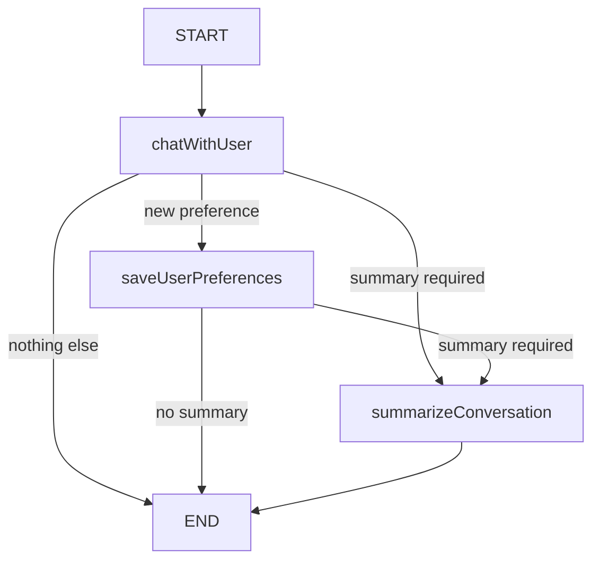

# poc_java_ia_recomendadormusical

A didactic **music recommender with memory**, migrated from the Module 04 JavaScript/TypeScript project to **Java 21 + Spring Boot**.

The goal is not to build a complete Spotify-like product. The goal is to understand how an AI application can:

1. talk to a user;
2. recommend specific songs;
3. extract preferences explicitly stated by the user;
4. persist those preferences;
5. remember the same user in a future conversation;
6. keep recent conversation history;
7. summarize history when it becomes too large.

This README assumes Java knowledge but no prior AI expertise.

---

## 1. Core idea

A stateless application forgets everything between conversations. This project separates two kinds of memory:

```text
Short-term/thread memory -> PostgreSQL checkpoints through LangGraph4j
Long-term/user memory    -> SQLite preferences and summarized context
```

A new thread does not reuse the full history of an older thread, but it can reuse the long-term preferences of the same `userId`.

---

## 2. Technology stack

| Technology | Role |
|---|---|
| Java 21 | main language |
| Spring Boot 3.5.16 | REST API and configuration |
| LangChain4j 1.20.2 | LLM integration using an OpenAI-compatible API |
| LangGraph4j 1.9.3 | state graph, nodes and conditional edges |
| OpenRouter | AI model gateway |
| LangSmith | workflow/LLM tracing and observability |
| OpenTelemetry 1.65.0 | exports Java spans to LangSmith over OTLP |
| PostgreSQL | LangGraph4j conversation checkpoints |
| SQLite | long-term user preferences and summary |
| Docker Compose | local PostgreSQL |
| JUnit 5 | tests |
| Postman | API examples |

The original TypeScript example uses LangChain and LangGraph, therefore the Java migration intentionally keeps both concepts through their Java counterparts.

---

## 3. What is an LLM?

A Large Language Model receives text and generates text. In this project it is used to:

- answer the user and recommend songs;
- extract explicit user preferences;
- summarize older conversation context.

The application does not train a model. It calls an existing model through OpenRouter.

---

## 4. Structured response

The chat prompt requests JSON similar to:

```json
{
  "message": "Try Everlong - Foo Fighters.",
  "preferences": {
    "name": "Vini",
    "age": null,
    "favoriteGenres": ["rock"],
    "favoriteBands": ["Queen"],
    "mood": null,
    "listeningContext": null,
    "additionalInfo": null
  },
  "shouldSavePreferences": true
}
```

This allows the same model call to return both a natural answer and machine-readable preference data.

The Java request also uses LangChain4j `ResponseFormat` with JSON type. This asks for JSON at the API level instead of relying only on prompt wording. The API therefore receives an explicit JSON-output requirement instead of relying only on prompt wording. The default model is kept aligned with the original project (`arcee-ai/trinity-large-preview:free`). The local parser still validates the payload before converting it to domain objects.

A critical rule is preserved from the lesson: **the assistant's own recommendations must never become user preferences unless the user explicitly states them**.

---

## 5. LangChain4j

`OpenRouterMusicAssistantClient` uses LangChain4j's `OpenAiChatModel` with OpenRouter's OpenAI-compatible base URL.

```text
Java -> LangChain4j -> OpenRouter -> LLM
```

The model is configurable through:

```text
OPENROUTER_MODEL=arcee-ai/trinity-large-preview:free
OPENROUTER_PROVIDER_SORT_BY=throughput
OPENROUTER_PROVIDER_PARTITION=none
```

The default model and provider-routing policy are intentionally aligned with the JavaScript project used in the lessons. The model remains configurable without changing the application workflow.

---

## 6. LangGraph4j

The workflow is a real graph, not a set of unrelated `if` statements:



### State

`MusicRecommendationState` is shared by graph nodes. It contains values such as:

```text
userId
currentUserMessage
messages
assistantMessage
extractedPreferences
shouldSavePreferences
needsSummarization
conversationSummary
```

### Nodes

- `ChatWithUserNode`: calls the LLM and extracts preferences.
- `SaveUserPreferencesNode`: merges new preferences into SQLite.
- `SummarizeConversationNode`: summarizes the conversation and trims active history.

### Conditional edges

`ConversationGraphRouter` chooses the next node using state flags.

---

## 7. LangSmith and tracing

The original JavaScript project configures **LangSmith** and the lesson uses tracing to inspect the execution chain. For that reason this Java migration keeps the observability concept instead of silently dropping it.

The Java implementation uses **OpenTelemetry spans exported through OTLP/HTTP to LangSmith**:

```text
Spring / LangGraph4j / LangChain4j
              │
              ▼
       OpenTelemetry spans
              │ OTLP/HTTP
              ▼
          LangSmith
```

`LangSmithTracingService` creates a trace such as:

```text
music-recommendation.chat
├── langgraph.node.chat-with-user
│   └── llm.openrouter.music-assistant-response
├── langgraph.node.save-user-preferences
└── langgraph.node.summarize-conversation
    └── llm.openrouter.conversation-summary
```

LangSmith is **optional at runtime**. To enable it:

```text
LANGSMITH_API_KEY=your_real_key
LANGSMITH_TRACING=true
LANGSMITH_PROJECT=04-song-highlights-java
```

The legacy variable names used by the JavaScript example, `LANGCHAIN_TRACING_V2` and `LANGCHAIN_PROJECT`, are also accepted. Full prompts and responses are not attached to spans by default.

---

## 8. PostgreSQL versus SQLite

### PostgreSQL

LangGraph4j `PostgresSaverV2` persists the state/checkpoints of a conversation thread. This enables state to survive JVM restarts.

### SQLite

`SqliteUserPreferenceMemoryRepository` stores reusable user facts:

```text
name
age
favorite genres
favorite artists/bands
key preferences
important context
```

This is intentionally separate from the thread checkpoint.

---

## 9. Conversation summarization

The default threshold is:

```text
MAX_MESSAGES_BEFORE_SUMMARY=6
```

Six messages are roughly three user/assistant exchanges.

When the threshold is reached:

1. the LLM produces a structured summary;
2. the summary is persisted as long-term memory in SQLite;
3. only the two most recent messages stay in the active context;
4. the updated graph state is checkpointed in PostgreSQL.

The final TypeScript source provided with the exercise used a threshold of `2` to demonstrate summarization quickly. The lesson explanation uses `6`, so this migration uses `6` as the configurable default.

---

## 10. Project structure

```text
poc_java_ia_recomendadormusical/
├── docs/
├── postman/
├── scripts/
├── src/main/java/br/com/vini/recomendadormusical/
│   ├── api/
│   ├── config/
│   ├── domain/
│   ├── exception/
│   ├── graph/
│   ├── observability/
│   ├── persistence/
│   ├── prompt/
│   ├── service/
│   └── util/
├── src/main/resources/application.yml
├── src/test/
├── .env.example
├── docker-compose.yml
├── pom.xml
├── README.md
└── README_EN.md
```

---

## 11. Requirements

- Java 21
- Maven 3.6.3+
- Docker + Docker Compose
- OpenRouter API key

---

## 12. Configuration

Copy the example file:

```bash
cp .env.example .env
```

Windows PowerShell:

```powershell
Copy-Item .env.example .env
```

Set at least:

```text
OPENROUTER_API_KEY=your_real_key
```

To enable the LangSmith observability shown in the lesson:

```text
LANGSMITH_API_KEY=your_real_key
LANGSMITH_TRACING=true
LANGSMITH_PROJECT=04-song-highlights-java
```

LangSmith is optional for the recommendation flow itself, but the integration is included because tracing is part of the original material. `.env` is ignored by Git.

---

## 13. Run

### Windows PowerShell

```powershell
.\scripts\start-local.ps1
```

### Linux/macOS

```bash
./scripts/start-local.sh
```

### Manual

```bash
docker compose up -d
```

Then export `OPENROUTER_API_KEY` and run:

```bash
mvn spring-boot:run
```

Health check:

```bash
curl http://localhost:8080/actuator/health
```

---

## 14. API

### Chat

```http
POST /api/v1/music/chat
```

Start a new thread:

```json
{
  "userId": "vini",
  "message": "I like rock and Queen is my favorite band. Recommend three songs."
}
```

Continue the same thread by sending the returned `threadId`:

```json
{
  "userId": "vini",
  "threadId": "THREAD_RETURNED_BY_THE_API",
  "message": "Now I want something calmer for studying."
}
```

### Long-term preferences

```http
GET /api/v1/users/{userId}/preferences
```

---

## 15. Postman

Import:

```text
postman/poc_java_ia_recomendadormusical.postman_collection.json
```

The collection includes health, first message, same-thread continuation, a new-thread memory test and long-term preference lookup. The first chat request stores the returned `threadId` automatically for the next request.

---

## 16. Tests

```bash
mvn test
```

Included tests cover:

- JSON parsing even when a model wraps JSON in Markdown fences;
- conditional graph routing;
- SQLite preference merging without case-only duplicates.

Build:

```bash
mvn clean package
```

Run the JAR:

```bash
java -jar target/poc_java_ia_recomendadormusical-0.0.1-SNAPSHOT.jar
```

---

## 17. Original TypeScript mapping

| Original | Java migration |
|---|---|
| `graph.ts` | `MusicRecommendationGraphConfiguration` + `MusicRecommendationState` |
| `chatNode.ts` | `ChatWithUserNode` |
| `savePreferencesNode.ts` | `SaveUserPreferencesNode` |
| `summarizationNode.ts` | `SummarizeConversationNode` |
| `edgeConditions.ts` | `ConversationGraphRouter` |
| `openrouterService.ts` | `OpenRouterMusicAssistantClient` |
| `preferencesService.ts` | `SqliteUserPreferenceMemoryRepository` |
| `memoryService.ts` | LangGraph4j `PostgresSaverV2` configuration |
| prompts | `MusicRecommendationPromptFactory` |
| CLI | Spring REST API + Postman |
| `LANGSMITH_*` / tracing setup | `LangSmithTracingService` + OpenTelemetry/OTLP |

See `docs/ANALISE_PROJETO_ORIGINAL.md` and `docs/MAPEAMENTO_TRANSCRICOES.md` for the detailed migration notes.

---

## 18. Deliberate adaptations and limitations

The original JavaScript project contains `langgraph.json` and uses `@langchain/langgraph-cli` for the JavaScript development/Studio workflow. This was not forgotten: in the Java migration, Spring Boot REST + Postman are the entry points, while LangGraph4j still implements the workflow itself. Copying the JavaScript `langgraph.json` into the Java project would not provide an equivalent runtime integration.

The original `package.json` also contains a few dependencies that are not used by the lesson's executed workflow (for example, Hugging Face/Transformers-related packages and a SQLite checkpoint dependency). They were intentionally not copied into Maven just to mirror the dependency list. The migrated flow uses OpenRouter for the LLM, SQLite for long-term preferences, and PostgreSQL for conversation checkpoints.

This is a learning POC, so it intentionally avoids unnecessary architecture.

- no authentication;
- `userId` is client-provided;
- summary threshold is message-count based, not token-count based;
- SQLite is local and simple;
- recommendation quality depends on the configured model;
- LangSmith tracing is optional and disabled by default;
- free models can occasionally return malformed JSON; the application accepts common fenced JSON but fails explicitly for truly invalid output.

The purpose is to make the AI workflow readable before adding production complexity.
